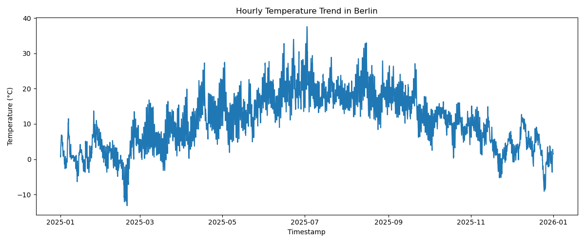

# Berlin Weather Pipeline


A data engineering portfolio project that collects, processes, validates, stores, and visualizes historical weather data for Berlin.

This project is part of my **Berlin Data Engineering Lab** portfolio. It provides the cleaned 2025 weather dataset that is later consumed by the **Berlin Analytics Warehouse** project.

## Project Purpose

The goal of this project is to demonstrate how to build a configurable API-based data pipeline.

The pipeline shows practical data engineering skills such as:

- API data ingestion
- JSON processing
- Data cleaning and transformation
- Configuration-driven execution
- Data validation
- CSV, Parquet, and SQLite storage
- Unit testing with pytest
- Code quality checks with Ruff
- GitHub Actions CI
- Reproducible local execution
- Basic visualization from processed data

## Data Source

This project uses the **Open-Meteo Historical Weather API** to retrieve hourly weather data for Berlin.

Open-Meteo provides historical weather data through its Historical Weather API, including hourly weather variables such as temperature, precipitation, and wind speed.

For this project, the pipeline retrieves weather data for Berlin for the year 2025.

```text
Latitude: 52.52
Longitude: 13.41
Timezone: Europe/Berlin
Start date: 2025-01-01
End date: 2025-12-31
```

Retrieved hourly variables:

```text
temperature_2m
precipitation
wind_speed_10m
```

## Portfolio Connection

This is the second project in the Berlin Data Engineering Lab portfolio.

```text
Project 1: Berlin Mobility Pipeline
        ↓
Project 2: Berlin Weather Pipeline
        ↓
Project 3: Berlin Analytics Warehouse
```

This project produces the weather file used by Project 3:

```text
data/processed/weather_2025_historical.parquet
```

The analytics warehouse combines this weather data with cleaned Berlin bike counter data.

## Pipeline Overview

```text
Open-Meteo Historical Weather API
        ↓
Ingest
        ↓
Raw JSON
        ↓
Transform
        ↓
Validate
        ↓
Load
        ↓
CSV / Parquet / SQLite
        ↓
Visualization
```

## Project Structure

```text
berlin-weather-pipeline/
├── config/
│   └── config.yaml
├── data/
│   ├── raw/
│   └── processed/
├── reports/
│   └── weather_temperature_trend.png
├── src/
│   ├── __init__.py
│   ├── ingest.py
│   ├── transform.py
│   ├── validate.py
│   ├── load.py
│   ├── visualize.py
│   └── main.py
├── tests/
│   ├── test_transform.py
│   ├── test_validate.py
│   └── test_load.py
├── .github/
│   └── workflows/
│       └── tests.yml
├── pyproject.toml
├── requirements.txt
└── README.md
```

## Main Pipeline Steps

### Ingest

`src/ingest.py` loads the configuration, calls the Open-Meteo Historical Weather API, and stores the raw JSON response locally.

Raw output:

```text
data/raw/weather_2025_historical_raw.json
```

### Transform

`src/transform.py` converts the nested JSON response into a tabular DataFrame.

The processed data contains these columns:

```text
timestamp
temperature_2m
precipitation
wind_speed_10m
```

### Validate

`src/validate.py` checks the transformed weather data before it is stored.

Validation checks include:

- The dataset is not empty
- Required columns are present
- `timestamp` has no missing values
- `temperature_2m` is not completely empty
- `precipitation` does not contain negative values
- `wind_speed_10m` does not contain negative values

### Load

`src/load.py` stores the validated data as CSV, Parquet, and SQLite.

Expected outputs:

```text
data/processed/weather_2025_historical.csv
data/processed/weather_2025_historical.parquet
data/processed/berlin_weather.db
```

### Visualize

`src/visualize.py` creates a temperature trend chart from the processed data.

Expected output:

```text
reports/weather_temperature_trend.png
```

## Configuration

The pipeline settings are stored in:

```text
config/config.yaml
```

Current configuration:

```yaml
api:
  base_url: "https://archive-api.open-meteo.com/v1/archive"
  latitude: 52.52
  longitude: 13.41
  timezone: "Europe/Berlin"
  start_date: "2025-01-01"
  end_date: "2025-12-31"
  hourly_variables:
    - temperature_2m
    - precipitation
    - wind_speed_10m

output:
  raw_json_path: "data/raw/weather_2025_historical_raw.json"
  processed_csv_path: "data/processed/weather_2025_historical.csv"
  processed_parquet_path: "data/processed/weather_2025_historical.parquet"
  sqlite_path: "data/processed/berlin_weather.db"
  table_name: "weather_2025_historical"

logging:
  level: "INFO"
```

## Local Setup

Clone the repository:

```bash
git clone https://github.com/muhannadnajjar1-hash/berlin-weather-pipeline.git
cd berlin-weather-pipeline
```

Install dependencies:

```bash
pip install -r requirements.txt
```

## Run the Pipeline

Run the full pipeline:

```bash
python src/main.py
```

Expected outputs:

```text
data/raw/weather_2025_historical_raw.json
data/processed/weather_2025_historical.csv
data/processed/weather_2025_historical.parquet
data/processed/berlin_weather.db
```

For a full year of hourly data, the pipeline should produce:

```text
8760 rows
```

## Generate the Visualization

Run:

```bash
python src/visualize.py
```

Expected output:

```text
reports/weather_temperature_trend.png
```

## Visualization

The following chart shows the temperature trend for Berlin based on the processed 2025 historical weather data.



## Tests and Linting

Run tests:

```bash
pytest
```

Run Ruff:

```bash
ruff check src tests
```

The tests check that:

- Weather JSON data is transformed correctly into a DataFrame
- Invalid API structures are detected
- Valid weather data passes validation
- Invalid weather data fails validation
- SQLite export creates a queryable table

## Continuous Integration

This project uses GitHub Actions to run Ruff linting and unit tests automatically on every push and pull request to the `main` branch.

The workflow is defined in:

```text
.github/workflows/tests.yml
```

The workflow runs:

```bash
ruff check src tests
pytest
```

## Current Results

A successful pipeline run currently produces hourly historical weather data for Berlin in 2025.

The latest local run produced:

```text
8760 hourly records
```

Processed columns:

```text
timestamp, temperature_2m, precipitation, wind_speed_10m
```

## Design Decisions

- The project uses a public API to demonstrate ingestion from an external data source.
- The raw JSON response is stored to keep the original API output traceable.
- Ingestion, transformation, validation, loading, and visualization are separated into different modules.
- The data is stored as CSV, Parquet, and SQLite to demonstrate multiple storage formats.
- The Parquet output is used by the downstream Berlin Analytics Warehouse project.
- The visualization is generated from processed data instead of being created manually.
- GitHub Actions checks linting and tests automatically.

## Current Limitations

- The pipeline currently retrieves a fixed 2025 date range from the configuration file.
- Incremental loading is not implemented yet.
- The visualization currently focuses on temperature only.
- The pipeline runs locally and is not scheduled automatically yet.

## Future Improvements

- Add scheduled execution with GitHub Actions.
- Add incremental loading for new weather records.
- Add precipitation and wind speed visualizations.
- Add a small data dictionary for output columns.
- Add stronger integration checks for the downstream warehouse project.
